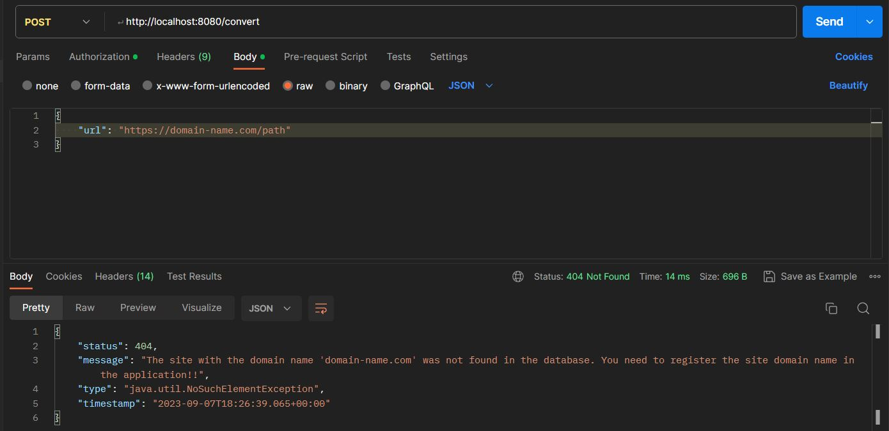

# job4j_url_shortcut
#### Сервис коротких ссылок
[](https://github.com/MasterMaxTs/project_rest-url_shortcut/actions/workflows/packaging.yml)

  &nbsp;&nbsp;&nbsp;<br>
  &nbsp;&nbsp;&nbsp;<br>
  &nbsp;&nbsp;&nbsp;<br>
  &nbsp;&nbsp;&nbsp;<br>
  &nbsp;&nbsp;&nbsp;
  &nbsp;&nbsp;&nbsp;
  &nbsp;&nbsp;&nbsp;<br>
  &nbsp;&nbsp;&nbsp;
  &nbsp;&nbsp;&nbsp;
  &nbsp;&nbsp;&nbsp;
  &nbsp;&nbsp;&nbsp;<br>
  &nbsp;&nbsp;&nbsp;
  &nbsp;&nbsp;&nbsp;
  &nbsp;&nbsp;&nbsp;
  &nbsp;&nbsp;&nbsp;
  &nbsp;&nbsp;&nbsp;<br>
  &nbsp;&nbsp;&nbsp;
  &nbsp;&nbsp;&nbsp;<br><br>
  &nbsp;&nbsp;&nbsp;


### Это проект по разработке сервиса, заменяющего URL ссылки на короткие.
#### Сервис работает через REST API.

___
### Требуемый функционал.

<br>
1. <b>Регистрация сайта.</b>

 - Сервисом могут пользоваться разные сайты;
 - каждому сайту выдается пара пароль и логин;
 - чтобы зарегистрировать сайт в систему нужно отправить запрос:

    - URL: POST /registration  с  телом JSON объекта: {site : "domain name"};

 - ответ от сервера: 
    - {registration : true/false, login: УНИКАЛЬНЫЙ_КОД, password : УНИКАЛЬНЫЙ_КОД};
    - флаг registration указывает, что регистрация выполнена или нет, то есть сайт уже есть в системе.

<br>
2. <b>Авторизация.</b>

 - Авторизация производится через JWT;
 - пользователь отправляет POST запрос с login и password и получает ключ KEY.

 - Этот ключ отправляется пользователем в запросе в блоке HEAD:

    - Authorization: Bearer KEY

<br>    
3. <b>Регистрация URL.</b>

 - Поле того, как пользователь зарегистрировал свой сайт, он может отправлять на сайт ссылки и получать преобразованные ссылки:

   - Пример:
     - отправляем URL: https://job4j.ru/profile/exercise/106/task-view/532;
     - получаем преобразованную ссылку:ZRUfdD2 (ключ ZRUfD2 ассоциирован с URL).

 - Описание вызовов:
   - POST /convert с телом JSON объекта {url: "https://job4j.ru/profile/exercise/106/task-view/532"}:
     - ответ от сервера: {code: УНИКАЛЬНЫЙ_КОД};

<br>
4. <b>Переадресация.</b>

 - Выполняется без авторизации;
 - когда сайт отправляет ссылку с кодом, в ответ нужно вернуть ассоциированный адрес и статус 302.
 - Описание вызовов:
     - GET /redirect/УНИКАЛЬНЫЙ_КОД:
       - ответ от сервера в заголовке: HTTP CODE - 302 REDIRECT URL.

<br>
5. <b>Статистика.</b>

 - В сервисе считается количество вызовов каждого адреса;
 - увеличение счетчика вызовов в базе данных;
 - по сайту можно получить статистику всех адресов и количество вызовов этого адреса.
 - Описание вызовов:
     - GET /statistic:
       - ответ от сервера JSON:{ {url : URL, total : 0},
{url : "https://job4j.ru/profile/exercise/106/task-view/532", total : 103} } 

         
---
### Стек технологий

- Java 11
- Spring-boot-starter-web v.2.7.13.
- Spring-boot-starter-data-jpa v.2.7.13
- Spring-boot-starter-security v.3.1.0
- Spring-boot-starter-validation v.2.7.13
- Lombok v.1.18.28.
- Java-JWT v.4.4.0
- Liquibase-core v.4.22.0
- СУБД: PostgreSQL v.14.0.
<br><br>
- Тестирование:
  - Spring-boot-starter-test v.2.7.13
  - БД: h2database v.2.1.214

<br>

- Упаковка проекта: Web Archive (.war)

---
### Требования к окружению
- Java 11
- Maven v.3.6.3
- PostgreSQL v.14.0

<br>

---
### Запуск проекта

#### <ins>Развёртывание приложения с помощью Docker (ОС Linux):</ins>

1. Проверить, установлен ли Docker:
   - терминал<br>
     ```docker --version```
   - если не установлен, установить
   

2. Проверить, установлен ли Docker Compose:
    - терминал<br>
      ```docker-compose --version```
    - если не установлен, установить
   

3. Скачать файлы проекта с github по ссылке и разархивировать в выбранную директорию проекта:<br>
      [https://github.com/MasterMaxTs/project_rest-url_shortcut/archive](https://github.com/MasterMaxTs/project_rest-url_shortcut/archive/refs/heads/master.zip)


4. Открыть терминал, перейти в директорию проекта:<br>
   - Для <ins>первого</ins> развёртывания и запуска приложения выполнить последовательно команды:
     - ```doсker-compose build```
     - ```docker-compose up```

   - Для <ins>последующего</ins> запуска приложения выполнять команду:
       - ```docker-compose start```
       - убедиться, что контейнеры были успешно запущены:


<br>
    
#### <ins>Запуск приложения локально:</ins>
1. Установить СУБД PostgreSQL


2. Создать базу данных с именем url_shortcuter:<br>
   ```create database url_shortcuter;```


3. Скачать файлы проекта с github по ссылке и разархивировать в выбранную директорию:<br>
   [https://github.com/MasterMaxTs/project_rest-url_shortcut/archive](https://github.com/MasterMaxTs/project_rest-url_shortcut/archive/refs/heads/master.zip)


4. Перейти в директорию проекта, открыть командную строку.</br>
 - Для <ins>первого</ins> запуска приложения выполнить последовательно команды:
     - ```mvn install```
     - ```java -jar target/urlshortcut-1.0.war```

 - Для <ins>последующего</ins> запуска приложения выполнять команду:
     - ```java -jar target/urlshortcut-1.0.war```
     


---
### Закрытие проекта

#### <ins>Закрытие в Docker:</ins>
- После <ins>первого</ins> запуска приложения в терминале выполнить:
  - ```Ctrl + C```

- После <ins>последующих</ins> запусков приложения в терминале выполнять команду:
    - ```docker-compose stop```
    - убедиться, что контейнеры были успешно остановлены:


<br>

#### <ins>Закрытие локально:</ins>
 - Закройте окно командной строки

<br>

---
### Взаимодействие с приложением

1. Вид вкладки Postman взаимодействия с приложением при успешной регистрации нового сайта


<br>

2. Вид вкладки Postman взаимодействия с приложением при не успешной регистрации сайта


<br>

3. Вид вкладки Postman взаимодействия с приложением при регистрации сайта c некорректно указанным доменным именем


<br>


4. Вид вкладки Postman взаимодействия с приложением при успешной аутентификации


<br>

5. Вид вкладки Postman взаимодействия с приложением при не успешной аутентификации


<br>

6. Вид вкладки Postman взаимодействия с приложением при успешном получении короткой URL ссылки


<br>

7. Вид вкладки Postman взаимодействия с приложением при получении короткой URL ссылки для не зарегистрированного сайта



<br>

8. Вид вкладки Postman взаимодействия с приложением при получении короткой URL ссылки, когда указано некорретное название URL


<br>

9. Вид вкладки Postman взаимодействия с приложением при запросе переадресации по корректной короткой URL ссылке


<br>

10. Вид вкладки Postman взаимодействия с приложением при запросе переадресации по не корректной короткой URL ссылке


<br>

11. Вид вкладки Postman взаимодействия с приложением при запросе статистических данных для зарегистрированного в приложении сайта


<br>

12. Вид вкладки Postman взаимодействия с приложением при запросе статистических данных для не зарегистрированного в приложении сайта


<br>

---
### Особенности технической реализации учебного проекта

<br>

 - В проекте ипользуются три текстовых генератора случайной кодовой последовательности
символов:
    - генератор логина;
    - генератор пароля;
    - генератор кода ссылки URL;
 
    <br>
 - каждый генератор имеет свою собственную настройку на основе данных в файле
конфигурации приложения:<br>
classpath: application-|profile name|.properties

<br>

 - <ins><b>Профили сборки проекта и файлы конфигурации приложения</b></ins>

| Профиль               | Файл                                     |
|:----------------------|:-----------------------------------------|
|                       | resources/ application.properties        |
| Докер (docker)        | resources/ application-docker.properties |
| Продакшн (prod)       | resources/ application-prod.properties   |
| Тестовый (test)       | resources/ application-test.properties   |


___
### Контакты
* email: max86ts@gmail.com
* telegram: matsurkanov